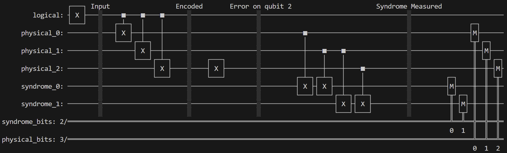
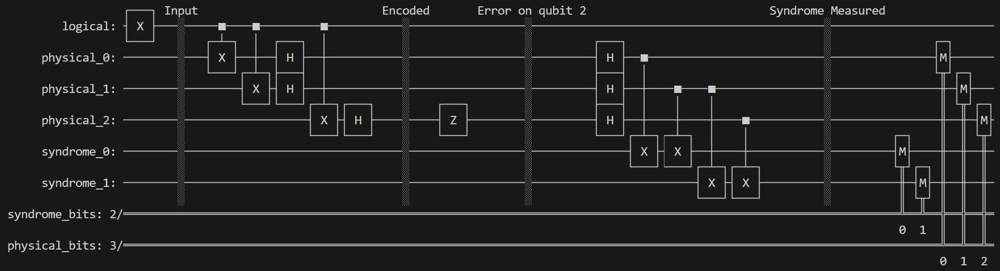

# qec-control-emulator
Quantum Error Correction Control Emulator project, mimics how a real QEC control system works.

## Setup

### Prerequisites
- Python 3.9 or higher
- pip

### Installation

1. **Create a virtual environment:**
   ```bash
   python -m venv venv
   source venv/bin/activate  # Windows: venv\Scripts\activate
   ```

2. **Install dependencies:**
   ```bash
   pip install -r requirements.txt
   ```

3. **Activate virtual environment:**
   ```bash
   venv\Scripts\activate
   ```

### Learning Resources
- Qiskit documentation: https://qiskit.org/documentation/

## Quantum Error Correction Circuits

### Bit-Flip Code


### Phase-Flip Code


## To Do:

- [ ] Add Shor's 9-Qubit Code
- [ ] Add Surface Code
